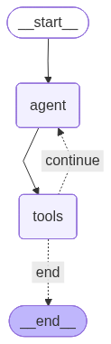

# Drafter Agent

An interactive AI powered document drafting assistant built with **LangGraph** and **Ollama** locally. Drafter lets you create, edit, and save text documents through a conversational loop just describe what you want, and the agent writes it for you.

---

## How It Works

Drafter runs as a **stateful LangGraph agent** that follows a cyclic workflow:



1. **Agent Node** — Collects user input, prepends a system prompt, and invokes the LLM.
2. **Tools Node** — Executes any tool calls the LLM requests (`update` or `save`).
3. **Conditional Edge** — After tool execution, checks if the document was saved. If yes, the graph ends; otherwise, it loops back to the agent for more edits.

---

## Tools

| Tool | Description |
|---|---|
| `update(content)` | Replaces the in memory document with the provided content. Always expects the **full** document, not a diff. |
| `save(filename)` | Writes the current document to a `.txt` file on disk and terminates the session. |

---

## 🚀 Getting Started

### Prerequisites

- **Python 3.10+**
- **Ollama** installed and running locally with the `llama3.1` model pulled:
  ```bash
  ollama pull llama3.1
  ```

### Installation

```bash
pip install langgraph langchain-core langchain-ollama
```

### Run

```bash
python drafter.py
```

You'll be prompted to describe what you'd like to draft. The agent will generate the document, and you can iteratively refine it. When you're satisfied, ask the agent to **save** and the file will be written to disk.

---

## Example Session

```
 Drafter Agent Started!

What would you like to draft? Write a leave notification email for April 30th

AI: I'll draft that for you.
Tool call: update({"content": "Subject: Leave Notification ..."})
Tool Result: Document updated successfully!

What would you like to do with the document? Make the tone more formal

AI: Sure, here's the updated version.
Tool call: update({"content": "Subject: Leave Notification ..."})
Tool Result: Document updated successfully!

What would you like to do with the document? Save it as leave_notification

Tool call: save({"filename": "leave_notification"})
Document is saved to leave_notification.txt

 Drafter Agent Finished!
```

---
